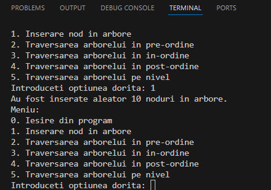
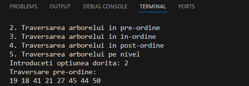
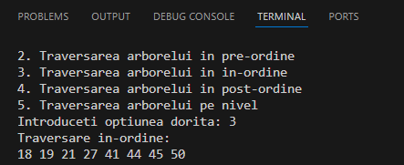
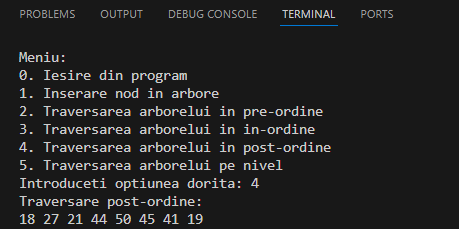

# 🌳 BINARY SEARCH TREE (Arbore binar ordonat) - Implementare în limbajul C 

# Bun venit! :tada:

## 🗺️ Descrierea Proiectului
Acest proiect introduce conceptul de **Binary Search Tree (BST)** sau **Arbore Binar Ordonat**, implementat în limbajul de programare C. 

## 🎯 Scop 
Prin implementarea acestui proiect, doresc să demonstrez cât de util este tipul de date **Arbore Binar Ordonat (BST)** și cât de ușor poate fi utilizat pentru a organiza și manipula eficient datele. Proiectul pune accent pe inserarea nodurilor într-un arbore binar ordonat și pe utilizarea diferitelor tehnici de traversare (in-ordine, pre-ordine, post-ordine, pe nivel) pentru a explora structura arborelui și a facilita gestionarea datelor într-o manieră ordonată.

## ⚙️ Detalii Despre Implementare
Proiectul implementează un **Arbore Binar Ordonat (BST)** în limbajul **C**, cu următoarele funcționalități:
- **Inserare noduri**: Nodurile sunt inserate într-un arbore binar ordonat conform regulilor BST (nodurile din subarborele stâng sunt mai mici decât nodul curent, iar cele din subarborele drept sunt mai mari).
- **Traversări**: Sunt implementate patru tipuri de traversări ale arborelui:
  - **In-ordine (in-order traversal)**: vizitează nodurile în ordinea *stânga -> rădăcină -> dreapta.*
  - **Pre-ordine (pre-order traversal)**: vizitează nodurile în ordinea *rădăcină -> stânga -> dreapta.*
  - **Post-ordine (post-order traversal)**: vizitează nodurile în ordinea *stânga -> dreapta -> rădăcină.*
  - **Pe nivel (level-order traversal)**: vizitează nodurile nivel cu nivel, de la *rădăcină* către *frunze*.

## 💻 Platformă Software Utilizată
Proiectul a fost realizat în limbajul de programare **C**.
Pentru dezvoltare, s-au utilizat următoarele platforme:
* IDE: **Visual Studio Code (VSC)**
  * Descarcă VSC: *https://code.visualstudio.com/*
* Compilator: **GCC** (GNU Compiler Collection) 
  * Descarcă GCC: *https://gcc.gnu.org/*
* Sistem de Operare: Principal pe **Windows**, cu extensie **Linux** (Windows Subsystem for Linux - WSL) 
  * Descarcă Windows: *https://www.microsoft.com/en-us/windows*
  * Descarcă WSL: *https://docs.microsoft.com/en-us/windows/wsl/install*

## 🔧 Modalități De Rulare
1. **Descarcă Visual Studio Code**  
   Dacă nu ai deja instalat, descarcă și instalează Visual Studio Code, folosind link-ul din secțiunea **Platformă Software Utilizată**.  

2. **Descarcă Proiectul**  
   Clonează acest repository GitHub.  
   Deschide folderul proiectului în Visual Studio Code.  

3. **Configurează Proiectul**  
   Dacă nu ai extensia **C/C++** instalată, mergi la secțiunea **Extensions** (Ctrl+Shift+X) și instalează extensia oficială C/C++ de la Microsoft.  
   Când deschizi proiectul, Visual Studio Code va detecta automat fișierul `proiectBST.c`.

4. **Rulare Directă**  
   Apasă `F5` (Run) pentru a compila și rula proiectul direct din Visual Studio Code.  

5. **Testează Funcționalitățile**  
   Acum este momentul să te joci cu proiectul! Interacționează cu meniul și explorează cum funcționează inserarea nodurilor și traversările arborelui. Încearcă diferitele opțiuni și vezi cum se organizează datele în arbore!  
   Distracție plăcută și mult succes în explorarea **Arborelui Binar Ordonat (BST)**! 😊

## 📊 Rezultate și Exemple De Rulare
La rularea programului, se interacționează cu următorul meniu:

Odată cu selectarea opțiunii **1**, se inserează aleator 10 noduri în arborele binar de căutare.

Opțiunea **2** (traversarea pre-ordine) produce următorul rezultat:

Opțiunea **3** (traversarea in-ordine) produce următorul rezultat:

Opțiunea **4** (traversarea post-ordine) produce următorul rezultat:

